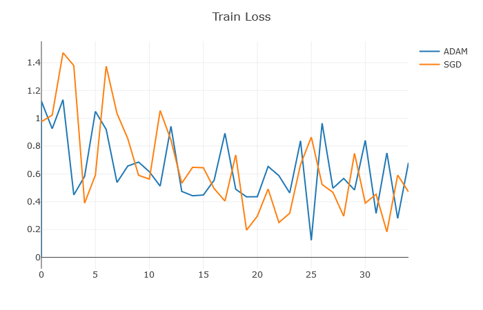
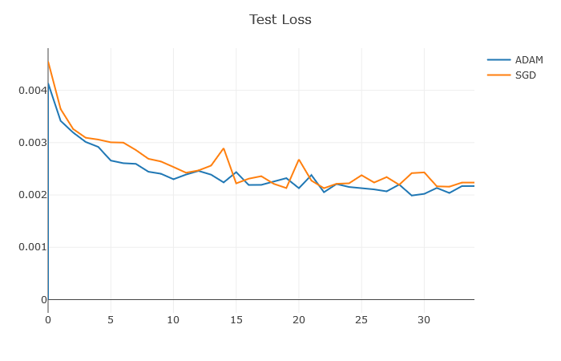
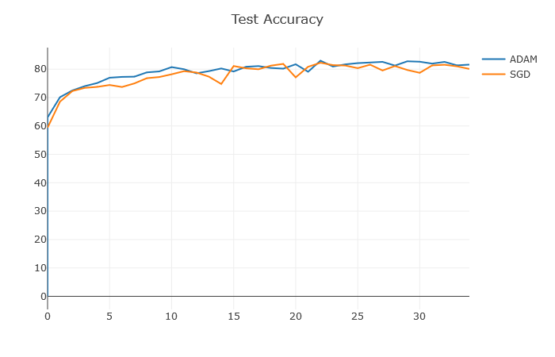
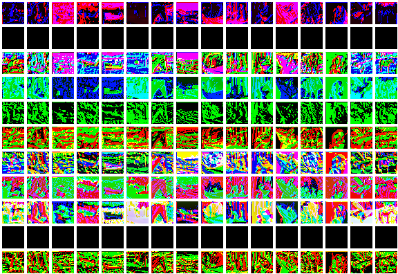
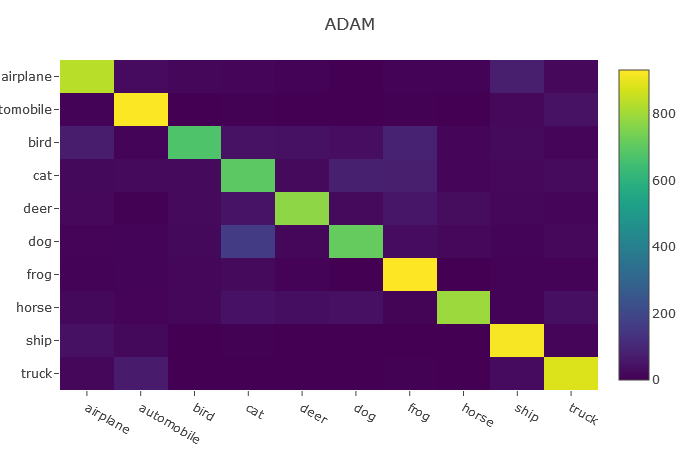

# CIFAR10_Classifier using Pytorch

### Dependencies:
Pytorch (0.4.1)  
Visdom

### Goal
To achieve highest possible accuracy on CIFAR10 dataset using  CNN

### Observations
The current model using 4 layers of Convolutions with a kernel size of 3x3 provides the best accuracy till now (80%). The usual dropouts in the CNN layers have been removed in favour of a single dropout in the fully connected layer as the former did not seem to enhance the performance in this case. Augmenting the dataset by flipping the images and upscaling them to twice their original size improves the accuracy considerably. The overall performance using both SGD and ADAM were similar. However with Adam the risk of overfitting/underfiiting seemed greater as the weight decay term needed a lot of tuning.  
 
This is certainly not the best accuracy achievable on the CIFAR10 dataset as 94-96% have been achieved in fairly [recent work](http://rodrigob.github.io/are_we_there_yet/build/classification_datasets_results.html#43494641522d3130).

**Training Loss**  

**Validation Loss**  

**Training Loss**  

**Trained Filters Example** 

**Convolution Output Example**  

**Confusion Matrix Example**  

### How to run
Load the notebook file in jupyter and run each cell sequentially. Visdom is used to visualize the progression of trained filters and accuracies over each epoch.
