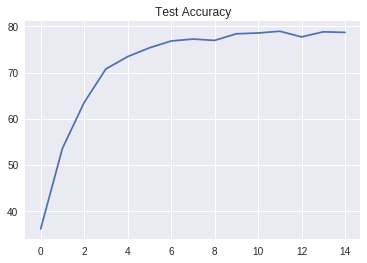

# Transfer Learning using Pytorch

The weights of a trained network can be used for classification on a different dataset with a similar distribution.
We test this using the pre-trained (on Imagenet) networks provided by the ```torchvision.models``` library 
on the [CUB_200_2011](http://www.vision.caltech.edu/visipedia/CUB-200-2011.html) database.

### Prerequisites

Pytorch
Torchvision
Matplotlib

## Running the notebook file

```
git clone https://github.com/tridivb/Fun_with_Pytorch.git
```

Start jupyter notebook and load the ipynb file. Execute each cell sequentially.

Alternatively, load the notebook into [Google Colab](https://colab.research.google.com/) and execute the notebook.
If you face the following error while loading the dataset,
```
AttributeError: module ‘PIL.Image’ has no attribute ‘register_extensions
```
try installing Pillow 4.1.1 by executing the following code snippet in Colab.
```
!pip install Pillow==4.1.1
```
I guess, this is because of recent changes to the pytorch libraries.

# Results and Remarks
The classifer was tested with the different Resnet models after augmenting the dataset and all of them seem to be pretty
consistent in their overall validation accuracy of 77-79% over 15 epochs. This does not look bad but it should be possible to increase the accuracy by tweaking the network parameters further or maybe training the network solely on the CUB dataset. For now, this remains as part of future tests.



## Acknowledgments

* https://machinelearningmastery.com/transfer-learning-for-deep-learning/ 
* This readme template is borrowed from https://gist.github.com/PurpleBooth/109311bb0361f32d87a2
* http://www.ais.uni-bonn.de/WS1819/P_CudaVision.html